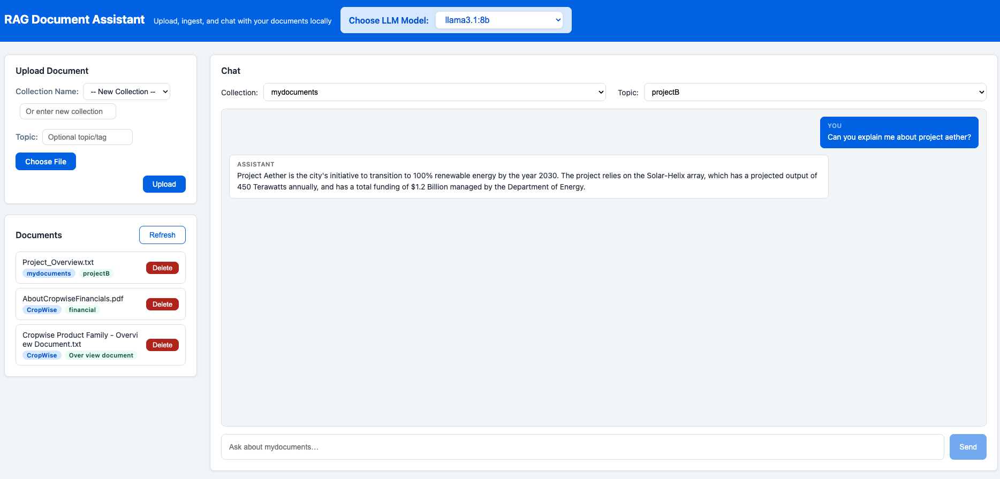

# RAG Experiment

A local **Retrieval-Augmented Generation (RAG)** system with a web-based UI. Upload private documents (PDFs, TXT files), generate embeddings, store them in a local vector database, and ask natural-language questions about your documents — all without your data ever leaving your machine.

---


## UI Screenshot



## Features

- 📄 **Document Upload** — Upload PDF and TXT files via the web UI
- �️ **Per-Collection/Topic Organisation** — Assign each document to a named collection and optional topic at ingest time; collections are created on demand
- 🔍 **Vector Ingestion** — Chunk documents, generate embeddings (768-dim), and store them in Qdrant with deterministic UUIDs so re-ingesting a file replaces only its own chunks
- 📋 **Grouped Document List** — View documents grouped by **Collection**, **Topic**, or flat alphabetical order; groups are collapsible
- 💬 **Filtered Chat** — Select a collection/topic in the chat panel to scope RAG retrieval to that collection only
- 🤖 **Local LLM** — Powered by Ollama; no cloud API keys required; choose the model from the header dropdown
- 🗑️ **Safe Delete** — Deleting a file removes only its vectors from the collection; the collection itself is deleted only when its last file is removed
- 🔒 **Privacy-first** — All processing happens on your machine

---

## Tech Stack

| Layer | Technology |
|---|---|
| **LLM Inference** | [Ollama](https://ollama.ai) (`llama3.1:8b`) |
| **Embedding Model** | `nomic-embed-text` (via Ollama) |
| **Vector Database** | [Qdrant](https://qdrant.tech) |
| **Orchestration** | [LangChain](https://www.langchain.com) |
| **Backend** | [FastAPI](https://fastapi.tiangolo.com) + [Uvicorn](https://www.uvicorn.org) |
| **Frontend** | [React 18](https://react.dev) + [Vite](https://vitejs.dev) |

---

## Project Structure

```
rag_experiment/
├── requirements.txt          # Python dependencies
├── ingest.py                 # Standalone document ingestion script
├── chat.py                   # Standalone command-line chat script
├── backend/
│   ├── app.py                # FastAPI application — all REST endpoints
│   ├── chat_service.py       # RAG logic: embed query → Qdrant search → Ollama LLM
│   ├── ingest_service.py     # Chunk, embed, upsert to named Qdrant collection
│   ├── file_service.py       # File upload & listing utilities
│   └── tests/
│       ├── test_chat_service.py
│       ├── test_ingest_service.py
│       └── test_file_service.py
├── frontend/
│   ├── package.json
│   ├── vite.config.js        # Dev server (port 3000) & API proxy → localhost:8000
│   └── src/
│       ├── App.jsx            # Root component: state, model selector, layout
│       ├── api.js             # All API client functions
│       ├── index.css          # Global styles & design tokens
│       └── components/
│           ├── DocumentUpload.jsx   # Upload + ingest with collection/topic fields
│           ├── DocumentList.jsx     # Grouped/sorted document list with badges
│           └── ChatInterface.jsx    # Chat UI with collection/topic filter dropdown
└── data/                     # Uploaded documents (auto-created, git-ignored)
```

---

## Prerequisites

Before running the project, install and configure the following:

### 1. Python 3.11

Verify your Python version:
```bash
python --version
```

### 2. Node.js 18+ and npm

Verify your Node.js version:
```bash
node --version
npm --version
```

### 3. Ollama

Download and install Ollama from [https://ollama.ai](https://ollama.ai), then pull the required models:
```bash
ollama pull llama3.1:8b
ollama pull nomic-embed-text
```

Start the Ollama service (it typically starts automatically after installation):
```bash
ollama serve
```

Ollama runs on **http://localhost:11434** by default.

### 4. Qdrant

Run Qdrant locally using Docker:
```bash
docker run -p 6333:6333 qdrant/qdrant
```

Or download and run the [Qdrant binary](https://qdrant.tech/documentation/guides/installation/) directly.

Qdrant runs on **http://localhost:6333** by default.

---

## Local Setup

### Backend

> Requires Python 3.11

```bash
# 1. Create and activate a Python virtual environment
python3.11 -m venv venv
source venv/bin/activate       # macOS/Linux
# venv\Scripts\activate        # Windows

# 2. Install Python dependencies
pip install -r requirements.txt

# 3. Start the FastAPI backend server
uvicorn backend.app:app --reload --host 0.0.0.0 --port 8000
```

The backend API is now available at **http://localhost:8000**.  
Interactive API documentation (Swagger UI) is available at **http://localhost:8000/docs**.

### Frontend

Open a new terminal window:

```bash
# 1. Navigate to the frontend directory
cd frontend

# 2. Install Node.js dependencies
npm install

# 3. Start the Vite development server
npm run dev
```

The frontend is now available at **http://localhost:3000**.  
API calls from the frontend are automatically proxied to the backend at `http://localhost:8000`.

---

## Usage

1. **Open the web UI** at http://localhost:3000
2. **Select an LLM model** from the dropdown in the header (fetched from Ollama)
3. **Upload a document** — in the upload panel, choose or create a **Collection** (logical group, e.g. `agriculture`) and optionally enter a **Topic** (e.g. `crop-diseases`), then pick your PDF/TXT file and click **Upload & Ingest**
4. **Browse documents** in the left sidebar — use the **Group by** buttons to view files organised by Collection, Topic, or Name; click a group header to collapse/expand it
5. **Filter chat by collection** — in the Chat panel, select a Collection or Topic from the dropdown; subsequent questions will only search within that collection
6. **Ask questions** — type your question and press **Send**; the RAG pipeline retrieves the most relevant chunks from Qdrant and passes them as context to the LLM
7. **Delete a document** — click **Delete** on any document; only that file's vectors are removed; the collection is automatically cleaned up if it becomes empty

---

## API Endpoints

| Method | Endpoint | Description |
|--------|----------|-------------|
| `GET` | `/` | Health check |
| `POST` | `/upload` | Upload a document file |
| `GET` | `/documents` | List filenames on disk |
| `GET` | `/documents/info` | List documents with collection & topic metadata (from Qdrant) |
| `POST` | `/ingest` | Ingest a document — accepts `filename`, `collection_name`, `topic` |
| `POST` | `/chat` | RAG chat — accepts `question`, `model`, `collection_name`, `topic` |
| `DELETE` | `/documents/{filename}` | Delete a file's vectors; accepts `?collection_name=`; drops the collection if empty |
| `GET` | `/collections` | List all Qdrant collections |
| `GET` | `/collection/{name}` | Get details of a specific collection |
| `POST` | `/search` | Vector search within a collection with optional metadata filters |
| `GET` | `/llm-models` | List available Ollama models |

Full interactive documentation is available at **http://localhost:8000/docs** when the backend is running.

---

## Running Tests

Tests are located in `backend/tests/` and use [pytest](https://pytest.org).

```bash
# Activate the virtual environment first
source venv/bin/activate

# Run all tests
pytest

# Run with verbose output
pytest -v

# Run a specific test file
pytest backend/tests/test_chat_service.py

# Run with test coverage report
pytest --cov=backend --cov-report=html
```

---

## Standalone Scripts

In addition to the web UI, two standalone command-line scripts are available:

### Ingest documents from the `data/` directory
```bash
python3 ingest.py
```

### Interactive command-line chat
```bash
python3 chat.py
```

---

## Environment Summary

| Service | Default URL |
|---------|-------------|
| Frontend (Vite) | http://localhost:3000 |
| Backend (FastAPI) | http://localhost:8000 |
| Qdrant Vector DB | http://localhost:6333 |
| Ollama LLM Service | http://localhost:11434 |

